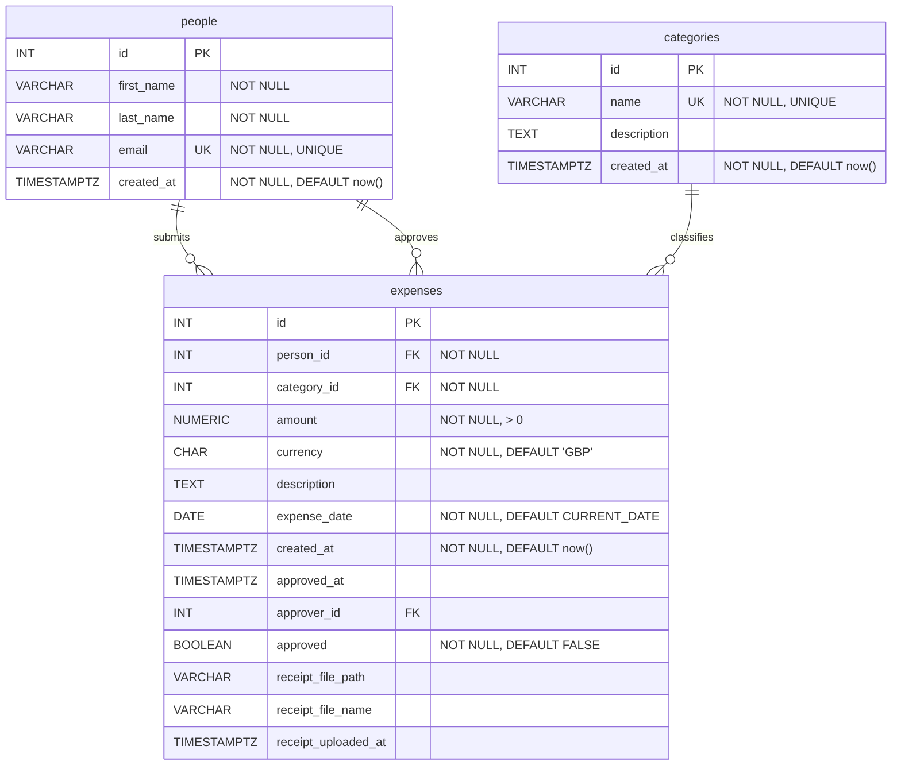

# Entity Relationship Diagram

View this in VSCode by installing the "Markdown Preview Mermaid Support" extension and then opening this file and using the "Open Preview to the Side" option.

```mermaid
erDiagram
    categories {
        INT id PK
        VARCHAR name UK "NOT NULL, UNIQUE"
        TEXT description
        TIMESTAMPTZ created_at "NOT NULL, DEFAULT now()"
    }

    people {
        INT id PK
        VARCHAR first_name "NOT NULL"
        VARCHAR last_name "NOT NULL"
        VARCHAR email UK "NOT NULL, UNIQUE"
        TIMESTAMPTZ created_at "NOT NULL, DEFAULT now()"
    }

    expenses {
        INT id PK
        INT person_id FK "NOT NULL"
        INT category_id FK "NOT NULL"
        NUMERIC amount "NOT NULL, > 0"
        CHAR currency "NOT NULL, DEFAULT 'GBP'"
        TEXT description
        DATE expense_date "NOT NULL, DEFAULT CURRENT_DATE"
        TIMESTAMPTZ created_at "NOT NULL, DEFAULT now()"
        TIMESTAMPTZ approved_at
        INT approver_id FK
        BOOLEAN approved "NOT NULL, DEFAULT FALSE"
        VARCHAR receipt_file_path
        VARCHAR receipt_file_name
        TIMESTAMPTZ receipt_uploaded_at
    }

    people ||--o{ expenses : "submits"
    people ||--o{ expenses : "approves"
    categories ||--o{ expenses : "classifies"
```
